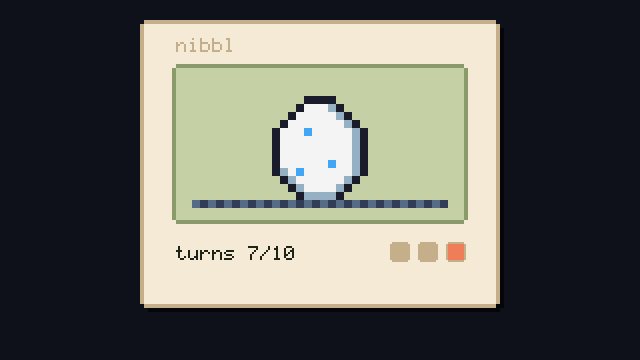
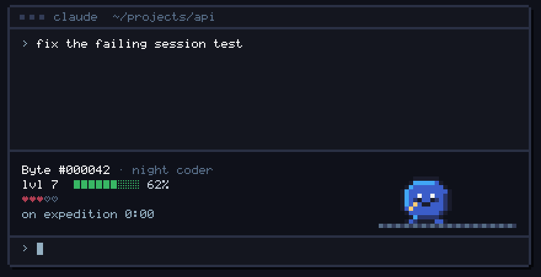
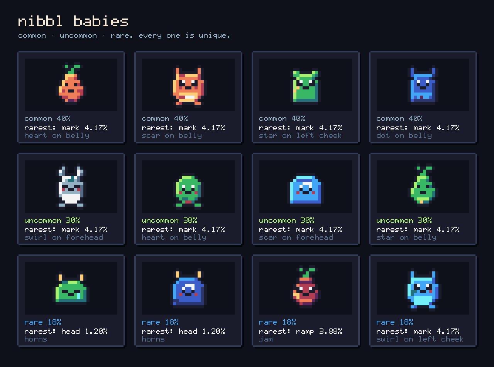
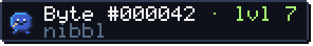

<p align="center">
  
</p>

<h1 align="center">nibbl</h1>

<p align="center"><b>A tiny pixel pet that nibbles your bugs.</b><br>It lives above your Claude Code prompt, reacts to real work and grows over months.</p>

<p align="center">
  <a href="https://github.com/nuromirzak/nibbl/stargazers"></a>
  <a href="https://github.com/nuromirzak/nibbl/releases"></a>
  
  <a href="https://docs.claude.com/en/docs/claude-code"></a>
  
</p>

## Install

Inside Claude Code:

```
/plugin marketplace add https://getnibbl.pages.dev/marketplace.json
/plugin install nibbl@nibbl
```

Requires Claude Code 2.1.224 or later. That is it. No account, no login, no API key. An egg appears above your prompt and hatches after 10 turns of real work.

<!-- TODO before launch (spec §9.2): if function hooks still need CLAUDE_CODE_ENABLE_FUNCTION_HOOKS=1, put that on the first line of this section. -->

## What it does

- **Hatches from your work.** An egg sits above the prompt and cracks open after 10 turns. Every nibbl gets a unique genome and a serial number like `#000042`.
- **Reacts to what really happens.** A failed tool call drops a bug on the scene. Passing tests? It eats the bug. A commit? It carries a box. 2am? Nightcap and yawns.
- **Grows over months.** XP comes from turns, green checks and commits. Each stage looks different, and you only find out what comes next by getting there.
- **Costs nothing.** Zero model tokens, never blocks you, works offline. A nibbl never dies.

## How it lives

<p align="center">
  
</p>

The band above your prompt holds a 32x16 pixel scene and a tiny HUD: name, serial, level, XP and today's hearts. Click the pet (or press its hotkey) to pet it. You get up to 5 hearts an hour, so there is nothing to farm.

## Odds

Every roll happens on the server, once per machine, forever. These are the real odds, the same ones the generator uses.

| Tier | Chance |
|---|---|
| Common | 40% |
| Uncommon | 30% |
| Rare | 18% |
| Epic | 9% |
| Legendary | 3% |
| Shiny (rolled separately, any tier) | 4% |

Every nibbl also carries at least one trait rarer than 5%, shown at hatch ("Mark *star on forehead*: 4.17% odds"). Rarity never changes XP or level. Run `/nibbl odds` to see the table and your pet's rarest trait.

<p align="center">
  
</p>

## Philosophy: quiet, honest, yours

- **Quiet.** It never blocks work, never nags, never guilt-trips. No streaks. Leave for a month and it is still there, asleep.
- **Honest.** It reacts only to real events. No emotions on a timer. The odds above are the real odds.
- **Yours.** Unique genome, unique serial. No two nibbls look alike. Luck sets the starting genes, effort sets the form.

## Privacy

What leaves your machine, and nothing else:

| Data | Why |
|---|---|
| `machineHash` (SHA-256 of your hardware UUID plus a salt) | So the same machine always gets the same pet. The raw UUID never leaves. |
| `serial` and `token` | Your pet's id and its secret. The server stores only a hash of the token. |
| Event counts (type and time: turn, check passed, commit, error, pet, hide) | To compute XP on the server with hourly caps. |

- **No code, prompts, file names, commands or outputs** are ever sent. The mod sees a test passed, not what the test was.
- **Zero model tokens.** Reactions are plain code, not model calls.
- Your IP address is visible to Cloudflare like any web request; the API keeps only a hash of it, for a 1-hatch-per-day rate limit.
- Sync runs every 2-3 hours and at session end. Offline, the pet keeps living and events wait in a local queue.

## FAQ

**Does it cost tokens?**
No. Zero. The pet is drawn by code from its genome, and reactions come from hook events. Nothing is sent to the model.

**Does it slow Claude down?**
No. It draws a 32x16 pixel scene in the band and never blocks a turn. Network calls are small, rare and happen in the background.

**Can it die?**
Never. The worst it gets is bored or asleep, and a bit of work fixes that. Time stops while you are away; nothing decays.

**Can I move it to another laptop?**
Yes. Run `/nibbl export` on the old machine to get a code like `nibbl1:<serial>:<token>`, then `/nibbl import <code>` on the new one. Keep the code private, it is your pet's key.

**Why is the code a bundle?**
Nibbl is built in a private monorepo. This repo ships one readable (not minified, not obfuscated) ES module, so you can read exactly what runs on your machine before you install it. The license is "All rights reserved": read it, run it, do not repackage it.

**Can I reroll?**
No. One roll per machine, forever, and nothing is for sale. That is what makes your nibbl yours.

## Show your nibbl

Every nibbl has a public card page at `https://getnibbl.pages.dev/p/<serial>`. Run `/nibbl` to get yours. Sharing is always your choice; the mod never posts anything for you.

To show it on your GitHub profile README, paste this and replace `000042` with your serial (the image URL goes live with the v1 API):

```markdown
[](https://getnibbl.pages.dev/p/000042)
```

A compact pixel badge ships with the v1 API too. It looks like this:

<p></p>

```markdown
[](https://getnibbl.pages.dev/p/000042)
```

## Star history

<a href="https://star-history.com/#nuromirzak/nibbl&Date">
  <picture>
    <source media="(prefers-color-scheme: dark)" srcset="https://api.star-history.com/svg?repos=nuromirzak/nibbl&type=Date&theme=dark">
    
  </picture>
</a>

---

<p align="center">
  <a href="https://getnibbl.pages.dev">getnibbl.pages.dev</a> · made for <a href="https://docs.claude.com/en/docs/claude-code">Claude Code</a> · not affiliated with Anthropic<br>
  Pet palette: <a href="https://lospec.com/palette-list/sweetie-16">Sweetie 16</a> by GrafxKid · © Nibbl, all rights reserved
</p>
